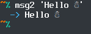

# msg2

* A way to output a blue arrow and a white message on the commandline.
* A commandline utility written in C++.
* The first argument may be a format string where `%s` is replaced with the rest of the arguments.

## Screenshot

## Why?

* `msg2` is already available in `PKGBUILD` packages in Arch Linux, as a `bash` function.
* Recently, `namcap` has begun to discourage the use.
* This utility provides the same functionality, but *should* be unproblematic, from the viewpoint of `namcap`.
* Makes `msg2` available to any distro, not just Arch Linux.

## Version

* 1.1.0

## License

* GPLv3

## Author

* Alexander F. Rødseth &lt;xyproto@archlinux.org&gt;
